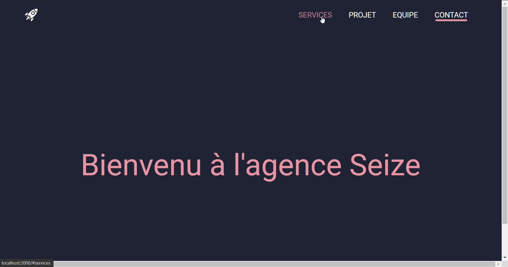

# Fonctionnement de l'exercice
Ce petit exercice consiste à évaluer vos compétences de développeur Full-Stack.
Le but est de réaliser la soumission d'un formulaire et d'en afficher la réponse sans rechargement.

## Prérequis :

- Pour réaliser cet exercice, vous aurez besoin a minima d'un environnement Apache (tel que WAMP, MAMP ou autre de votre choix).

## Structure des fichiers :

- index.php : Fichier contenant la page affichée sur le navigateur
- templates/form.php : Fichier contenant le contenu du formulaire
- templates/result.php : Fichier contenant le contenu de la réponse
- inc/functions.php : Fichier contenant les fonctions de l'excercice
- inc/process-form.php : Fichier qui devra contenir le traitement PHP utilisé dans la requête AJAX
- assets/styles.css : Fichier de styles CSS
- assets/scripts.js : Fichier de scripts JS

## Partie Back :

Il faut donc réaliser une soumission asynchrone du formulaire grâce à un traitement AJAX, alliant ainsi Javascript et PHP.
Pour cela, nous vous laissons libre d'utiliser la fonction Javascript fetch(), la fonction jQuery ajax() ou une autre fonction que vous maîtrisez.

Le principe est donc de :
- Capter la soumission du formulaire en Javascript
- Appeler le fichier PHP "inc/process-form.php" pour réaliser le traitement
- Vérifier que tous les champs sont correctement complétés (optionnel)
- Renvoyer la réponse dûment complétée en remplaçant les champs #...# du fichier "templates/result.php" par une intégration dynamique des champs saisis
- Afficher la réponse sur la page à la place du formulaire
  
---  

**remarque developpeur**  
- possibilité d'amelioration pour la geneartion dynamique des données avec regexpression cad remplacer dans le model #mavariable1# par ${mavariable1} => on s'affranchit de passer des  parametres 
- enregistrement en base de l'utilisateur (base de formulaire pour inscription ajout mot de passe md5 )
  
---  
## Partie Front :

Le but du jeu est d'intégrer les maquettes fournies dans le dossier /jpg, pour avoir un formulaire fonctionnel et beau :-).
Pour cela, le fichier /assets/styles.css est à votre disposition, pré-rempli avec une grille simplifiée qui reprend le principe col-md de Bootstrap par exemple (libre à vous de vous en servir).
Vous pouvez bien évidemment utiliser un autre langage que le CSS (sachant que nous utilisons SCSS compilé avec GULP à l'agence).

Le principe est donc de :
- Implémenter le HTML en conformité avec les maquettes
- Intégrer le CSS
- Gérer la partie responsive du site (les maquettes sont volontairement non fournies)
- S'il vous reste du temps et que vous trouvez cela utile en terme d'expérience utilisateur, vous pouvez ajouter des animations où bon vous semble

---  
**remarque developpeur**
- probleme de police suivant les navigateurs differents bien que l'import via google font soit réalisé... A creuser!

- utiliser le Scss pour factorisation du code et possibilité de gerer les couleurs du  theme + ajout d'un mode clair/sombre
- Modification futur de l'exercice en reactJS et axios pour appel asynchrone & changement d'etat des composants (utilisation useState & useEffect)

### Conclusion
- L'exercice etait vraiment super car il demande de  coller au plus pres du modele du design . C'est la dessus notemment sur partie  responsive du site que les amélioration sont a faire... Notemment lorsque l'ecran est petit basculer l'image vers le haut et utiliser la grille sur une colonne  !L'experience permettra de gagner en rapidité
( c'est la dessus qu'il faudra travailler pour acquerir de la rapidité!)

- Un echange à l'oral permettra d'aborder de nombreux point pour les axes d'ameliorations et progression de l'exercice ! 

---  
---  

## Resultat visuel obtenu

  
---  
DEMO : https://agenceseize-dgwebcreation.netlify.app/

## Travail realisé
- installation de laragon pour le serveur php avec domaine local https://exerciceseize.local
- gestion et soumission asynchrone du formulaire
- gestion des RGs pour verification des champs vides et formatage des champs mails et telehpones
- ajout d'un loader animé'  avec simulation de 1seconde coté traitement serveur
- Creation des ecrans.